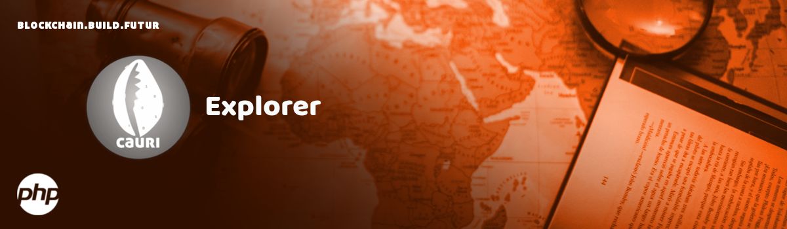

# Cauri Explorer

    

> Lead Maintainer: [Arsel Tindo](https://github.com/tnga)  
> Legacy Maintainer: [Michel Kraaijeveld](https://github.com/ItsANameToo)

## Installation

### Requirements

-   [Composer](https://getcomposer.org)
-   [Valet](https://laravel.com/docs/8.x/valet) or [Homestead](https://laravel.com/docs/8.x/homestead)

## Development

You can read more about production instructions at our [Development Documentation](https://dev.cauri.cm/docs/explorer/running-your-own-explorer-for-development).

## Deployment

You can read more about deployment instructions at our [Deployment Documentation](https://dev.cauri.cm/docs/explorer/running-your-own-explorer).

## Docker Deployment

You can read more about Docker deployment instructions at our [Docker Deployment Documentation](https://dev.cauri.cm/docs/explorer/running-your-own-explorer-with-docker).

## Security

If you discover a security vulnerability within this package, please send an e-mail to security@cauri.cm. All security vulnerabilities will be promptly addressed.

## Credits

This project exists thanks to all the people who [contribute](../../contributors).

## License

[MIT](LICENSE) © [Cauri Land](https://cauri.cm)
